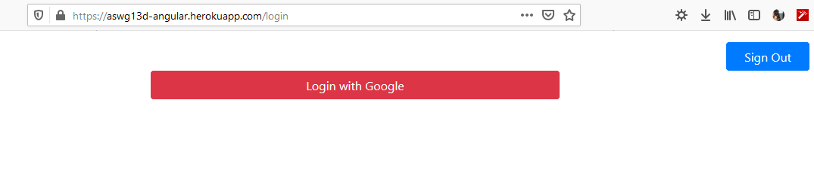
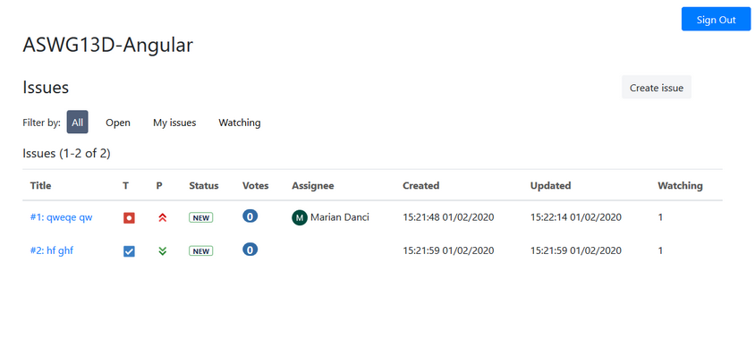
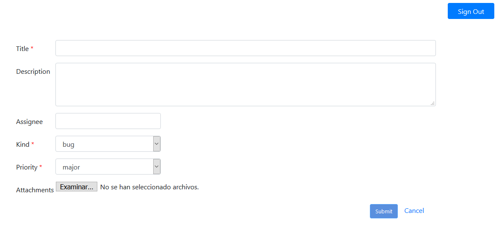
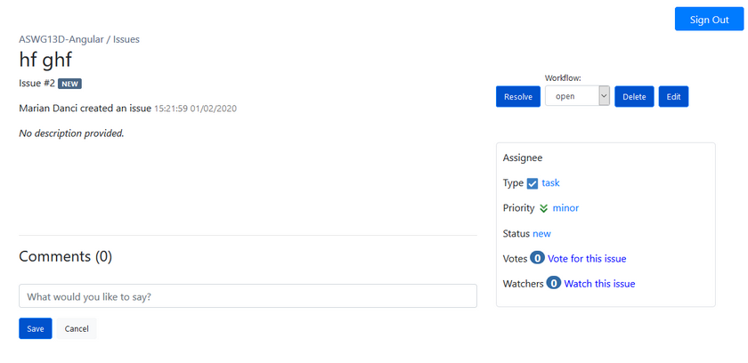
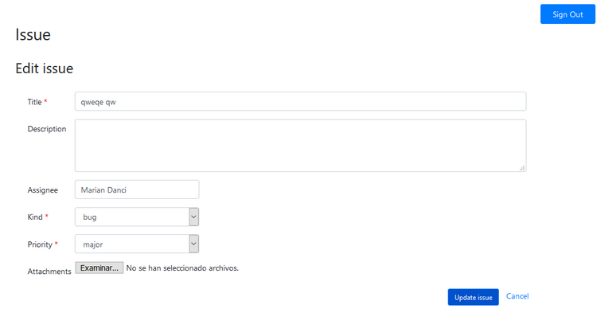

# IssueTracker 
Web made with [Angular](https://angular.io/), based on Bitbucket's Issue Tracker.

## Screenshots
These are some screenshots of the web.

### Login Page

### Home Page

### Create an Issue
After pressing on Create issue button at top right of home page.

### Issue Details
Issue details page where it can be seen the comments of it and its status, priority, votes and all its properties.

.png)
.png)

### Edit Issue

## Authors
- Danci, Marian Dumitru
- Ait Fonollà, Adem
- Segura Sánchez, Enric
- Conesa Gago, Agustí

Link heroku:
https://aswg13d-angular.herokuapp.com

Link swagger:
https://grup13aswd-rest-api-blabla.herokuapp.com/api/swagger-ui.html
